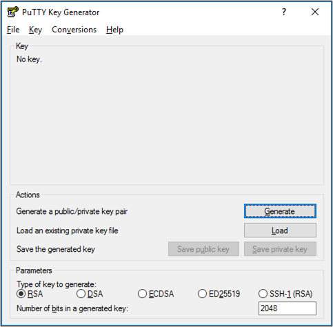
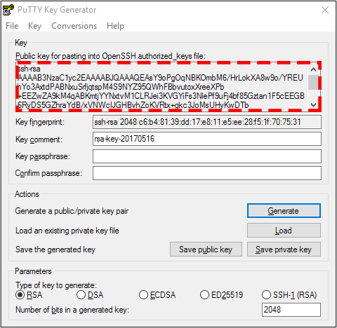

# How to Generate SSH Keys with TortoiseGit (Windows)
2024

## Introduction

Using an SSH key pair is a secure way of authenticating and accessing source code stored on remote servers.  TortoiseGit is an easy-to-use GUI for Git. This guide will describe how to generate an SSH pair so you can use TortoiseGit to connect with your version control system via SSH. This guide uses the Gitlab version control system but the steps are similar for most other popular tools such as GitHub. 

## Process Overview

1. Install the required software. 
2. Generate SSH keys via OpenSSH and the ssh-keygen command. 
3. Generate SSH keys via TortiseGit’s instance of PuTTY Key Generator. 
4. Register public SSH keys to GitLab. 

## Install the Following Required Software 

- [Git](https://git-scm.com/download/win)
- [TortoiseGit](https://tortoisegit.org/download/)
- [OpenSSH (Version 6.5 or later)](https://learn.microsoft.com/en-us/windows-server/administration/openssh/openssh_install_firstuse?tabs=gui)
- [PuTTy](https://www.putty.org/)

**Note:** OpenSSH is automatically installed on versions of Windows 10 or later.

## Create SSH Keys Using the TortoiseGit Putty Key Generator

**Important:** To use TortoiseGit with your Version Control provider (such as GitHub or Gitlab) using SSH, you must generate a key pair with the version of the PuTTY Key Generator that is bundled with TortoiseGit. Other versions of PuTTy may not be compatible with the version that comes with TortoiseGit. The default location for the PuTTY Key Generator instance that is installed with TortoiseGit is C:\Program Files\TortoiseGit\bin. After generating a key pair you must register the public key with your Version Control provider.

1. Navigate to **C:\Program Files\TortoiseGit\bin** and double-click **puttygen.exe** to open the PuTTY Key Generator.
2. At the bottom of the window select the type of key to generate. 
3. Click Generate and start moving your mouse over the blank area to generate a key pair. 
4. Enter a key comment. 
5. Enter a passphrase and confirm it. 
    - You have the option to leave the passphrase blank. 
6. Copy all of the text from the box containing the public key. 
7. Open a text editor and paste all of the text into a text file. 
8. In PuTTY Key Generator click **Save Private Key**. 
    - Ensure that you save the private key first to avoid any file extension confusion or overwrites. 
9. Click **Save Public Key**. 
10. Choose the location to save your public key. The default location is **C:\User\[YOUR USER]\.ssh**.

**Important:** Always keep your private key secure.

## Adding Public SSH Keys to Gitlab

1. In File Explorer, navigate to the folder where you stored your SSH keys after generating them. The default location is **C:\User\[YOUR USER]\.ssh**.
    - **.ssh** is a hidden folder. To view hidden folders in Windows 11, in File Explorer, navigate to **View > Show** and select **Hidden Items**. In previous Windows versions, navigate to Folder Options and select **Show Hidden Files, Folders, and Drives**.
2. Open the **.pub** file associated with the keys you generated in Notepad and copy all the text from the file (ctrl + A, ctrl + C).
3. In File Explorer, navigate to **View > Show** and select the file extensions checkbox to display file extensions. 
4. In Gitlab, navigate to **User Settings > SSH Keys**.
5. Click **Add New Key**.
6. In the key field, paste in all the text from the **.pub** file.
7. Enter a title for the key.
8. Set the usage type to **Authentication & Signing**.
9. Set the expiration date (optional).
10. Click **Add Key**.

## Test Your SSH Key Connection

1. Register your SSH key with your Version Control provider. 
2. Open a terminal and run **ssh -T git@gitlab.[YOUR GITLAB URL].com**. 
    - If this your first time connecting to the GitLab host, verify the authenticity of the host.
3. Run **ssh -T git@gitlab.[YOUR GITLAB URL].com** again and you should get a Welcome to GitLab, @username! message.
If the welcome message doesn’t appear, you can troubleshoot by running SSH in verbose mode using ssh -Tvvv git@gitlab.[YOUR GITLAB URL].com. 

## Set Default SSH Key in PuTTY 

1. In PuTTY navigate to **Connection > SSH > Auth > Credentials**.
    - The default location of the TortiseGit instance of PuTTY is **C:\Program Files\TortoiseGit\bin**.
2. Select the private key file that you generated using the TortoiseGit PuTTY Key Generator.
3. Navigate to Session, select default settings, and click **Save**.
Now PuTTY will use the correct private key for all new connections.  

**Important:** When cloning a repository using TortoiseGit ensure the load putty key option is selected and is referencing the correct key file.

## Resources 

- [SSH.com](https://www.ssh.com/academy/ssh/keygen)
- [Gitlab SSH Documentation](https://docs.gitlab.com/ee/user/ssh.html)
- [TortiseGit SSH Documentation](https://tortoisegit.org/docs/tortoisegit/tgit-ssh-faq.html#tgit-ssh-faq-defaultkey)
